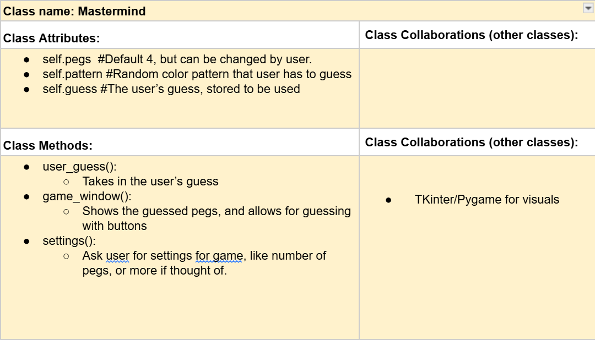
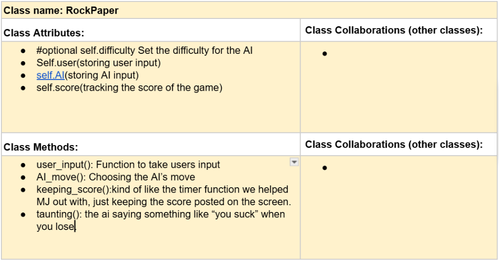
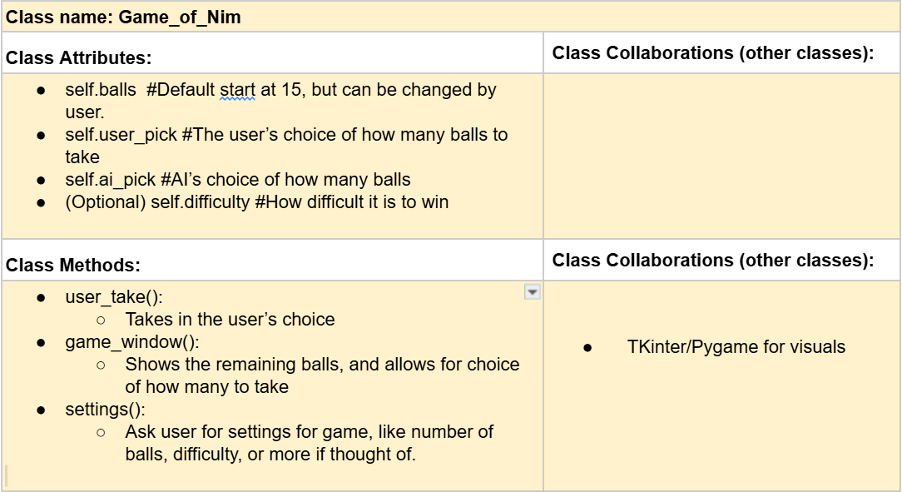

# CSC226 Final Project

## Instructions

**Author(s)**: Stephen Aaron Robinson & Dustan Webb

**Google Doc Link**: https://docs.google.com/document/d/1hF_YyhnfbonXv3Gwq11vM1z6Taylc1I5qp7h2871Wzk/edit?usp=sharing

---

## Milestone 1: Setup, Planning, Design

️**Title**: 3 in 1, Games of the Year Edition

**Purpose**: The user will get to choose between 3 games to play, including The Game of Nim, Rock Paper Scissors,
and Mastermind. The 3 games will have a main menu, the main menu is going to have a one sentence slight description of 
how the game is going to work and what the user will be doing. The main menu will be a seperate file and the master for 
all the games. All the games will be separated in files and will be short and sweet but with this being a final project
all the games together would take some time to play but all in all should be a blast. 

**Source Assignment(s)**: HW06: The Game of Nim (game_of_nim.py)

**CRC Card(s)**:
  




**Branches**: This project will **require** effective use of git. 

Each partner should create a branch at the beginning of the project, and stay on this branch (or branches of their 
branch) as they work. When you need to bring each others branches together, do so by merging each other's branches 
into your own, following the process we've discussed in previous assignments, then re-branching out from the merged code.  

```
    Branch 1 starting name: Robinson_Main
        Branch 1 assignments: Mastermind, Game of Nim, Game Selection
    Branch 2 starting name: Dwebb28
        Branch 2 assignments: Rock Paper Scissors, Game of Nim, Game Selection
```

### References 

Throughout this project, you will likely use outside resources. Reference all ideas which are not your own, 
and describe how you integrated the ideas or code into your program. This includes online sources, people who have 
helped you, AI tools you've used, and any other resources that are not solely your own contribution. Update this 
section as you go. DO NOT forget about it!

The Game of Nim, Rock Paper Scissors, and Mastermind games are not our ideas, but the code is ours.

---

## Milestone 2: Code Setup and Issue Queue

Most importantly, keep your issue queue up to date, and focus on your code. 🙃

Reflect on what you’ve done so far. How’s it going? Are you feeling behind/ahead? What are you worried about? 
What has surprised you so far? Describe your general feelings. Be honest with yourself; this section is for you, not me.

```
    Stephen Aaron Robinson: 11/17/2025 
        I've ran into a few issues so far, but ultimately feel good about how the project is going.
```
    Dustan M. Webb 11/23/2025
        I've gotten mojority of the code done, I have one massive bug that I need to fix and can't really figure it
        out so I think I'm going to head to the TA lab and get some help with it. But ultimately feel good on how 
        everything is going as a whole. 
---

## Milestone 3: Virtual Check-In

❗Indicate what percentage of the project you have left to complete and how confident you feel. 

❗️**Completion Percentage**: `0 - 100%`

❗️**Confidence**: Describe how confident you feel about completing this project, and why. Then, describe some 
  strategies you can employ to increase the likelihood that you'll be successful in completing this project 
  before the deadline.

```
    **Replace this with your reflection
```

---

## Milestone 4: Final Code, Presentation, Demo

### ❗User Instructions

❗In a paragraph, explain how to use your program. Assume the user is starting just after they hit the "Run" button 
in PyCharm. 

```
The user starts with a window with a window allowing them to select a game from the three choices of Rock Paper Scissors, 
Game of Nim, and Mastermind. They then get to play the game they selected. Instructions for these games are below.

Rock Paper Scissors: The user plays against an AI that taunts them constantly. They have 3 choices, Rock, Paper, and Scissors.
    The user will click one of the buttons to try and beat the AI, using the classic rules of Rock beats Scissors, Scissors beats Paper,
    and Paper beats Rock.
   
Game of Nim: 


Mastermind: The user is brought to a menu for Mastermind, with 2 buttons, "Play" and "Settings". If they choose settings,
    they can change the number of pegs (buttons) they have to guess the color of, and the number of guesses they get. If they
    don't change these settings, the default number for both is 4. When hitting play, the user is met with 2 windows, one with 4 blank pegs (Or whatever number they put in the settings),
    and the other with 4 buttons that are colored. They can use these color buttons to input a guess, that is showed to them as
    they input it, of the blank pegs in the other window. After inputing a guess of colors, the pegs on the other window updates
    to show which, if any, of the colors matched with the blank pegs' hidden colors. If the user guesses the correct pattern, they win,
    but if they use all of their guesses, they lose. 
```

### Errors and Constraints

Every program has bugs or features that had to be scrapped for time. These bugs should be tracked in the issue queue. 
You should already have a few items in here from the prior weeks. Create a new issue for any undocumented errors and 
deficiencies that remain in your code. Bugs found that aren't acknowledged in the queue will be penalized.

### ❗Reflection

❗Each partner should write three to four well-written paragraphs address the following (at a minimum):
- Why did you select the project that you did?
- How closely did your final project reflect your initial design?
- What did you learn from this process?
- What was the hardest part of the final project?
- What would you do differently next time, knowing what you know now?
- How well did you work with your partner? What made it go well? What made it challenging?

```
    Partner 1: **Replace this with your reflection
```

```
    Partner 2: **Replace this with your reflection
```

---